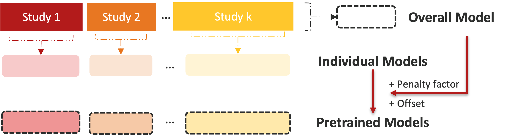
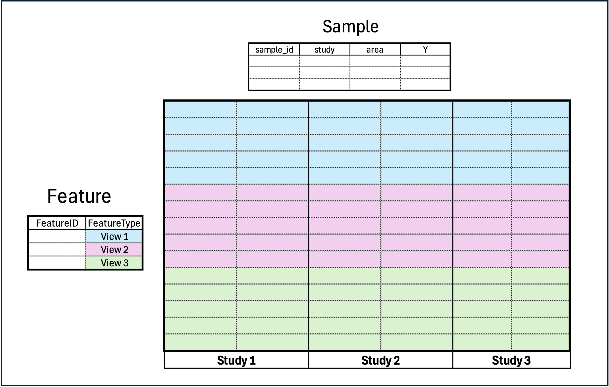

# GPTLasso

This repository houses the R package for multistudy multimodal transfer learning using **Global Pretraining and LASSO (`GPTLasso`)**.

It extends the `ptLasso` framework to support global multiview learning across multiple studies through cooperative-learning-based pretraining and transfer learning, with the current workflow centered on `gptLasso()` and `cv.gptLasso()`.



## Background

Modern biomedical prediction problems often involve multiple data modalities collected across several related cohorts, while each individual study may still be too small for stable model fitting. This project addresses that setting by combining multiview modeling with transfer learning so that information can be shared across both studies and modalities while still allowing study-specific refinement.

The framework uses a pretrained multiview model to learn shared structure, then fine-tunes study-level fits for improved local prediction. In simulations and motivating multi-omics applications, the goal is to improve predictive accuracy, estimation quality, and cross-study generalization relative to single-study or single-view approaches.

**Keywords:** Transfer learning, Cooperative learning, Multistudy analysis, Multimodal Integration, LASSO, Pretraining

## Installation

You can install the development version directly from GitHub:

``` r
install.packages("devtools")
devtools::install_github("himelmallick/GPTLasso")
library(GPTLasso)
```

## Get Started

### Bioconductor-style Input

GPTLasso requires a `x` as a named list containing `feature_table`, `sample_metadata`, and `feature_metadata`.



**Note on `study` Labels:**

`gptLasso` detects the study levels directly from `x$sample_metadata$study`. The unique values in that column, in their observed order, define the groups used to split the training data, constract study-specific models, and organize prediction summaries.

In this repository, `study` is the motivating example for handling different groups of data. In practice, users are welcome to define their own grouping variable in the same column, such as `area`, site, cohort, or any other project-tailored grouping that serves the scientific or operational goal of the analysis.

### Tool

``` r
fit <- gptLasso(
    x,                                                      # Input
    alpha_ptlasso = 0.5,                                    # Transfer-learning level in `[0, 1]`
    family = c("gaussian", "binomial"),                     # Response family
    type.measure = c("default", "mse", "auc", "deviance"),  # Cross-validation metric used inside the multiview fits
    rho = c(0, 0.1, 0.25, 0.5, 1, 5, 10),                   # Multiview cooperative learning confusion stage parameter, e.g., rho=0 -> early fusion
    overall.lambda = c("lambda.1se", "lambda.min"),         # Lambda rule used for the stage-one overall model
    ind.lambda = c("lambda.1se", "lambda.min"),             # Lambda rule used for the individual models
    pre.lambda = c("lambda.1se", "lambda.min"),             # Lambda rule used for the pretrained models
    nfolds = 10,                                            # Number of folds used when `foldid` is not supplied
    alpha_glmnet = 1                                        # Elastic-net mixing parameter, default is 1 indicating Lasso regression
)
```

## Tutorial

This Gaussian example tutorial walks through simulated data generation, model fitting, transfer-level tuning, and prediction on held-out data.

### 1. Simulate Gaussian multistudy multiview data

``` r
set.seed(1234)

gaussian_sim <- sim.gaussian.data()
x_train <- gaussian_sim$x_train
x_test <- gaussian_sim$x_test
y_test <- split(x_test$sample_metadata$Y, x_test$sample_metadata$study)
```

Inspect the container layout before fitting:

``` r
str(x_train, max.level = 1)
colnames(x_train$sample_metadata)
table(x_train$sample_metadata$study)
```

Example output:

``` text
==============================
Gaussian x_train 
==============================
List of 3
 $ feature_table   : num [1:658, 1:840] 0.0261 0.0215 0.7405 0.0733 0.2195 ...
  ..- attr(*, "dimnames")=List of 2
 $ sample_metadata :'data.frame':       840 obs. of  5 variables:
 $ feature_metadata:'data.frame':       658 obs. of  2 variables:

Sample metadata columns:
[1] "subjectID" "Y" "study"   "sample_id"

Study counts:

Study_1 Study_2 Study_3 
    350     280     210 
```

### 2. Fit a multistudy multiview transfer-learning model with `cv.gptLasso()`

``` r
cv_fit <- cv.gptLasso(
  x = x_train,                                  # Training input
  family = "gaussian",                          # Response family
  type.measure = "mse",                         # Cross-validation metric used inside the multiview fits
  rho = c(0, 0.5, 1),                           # Multiview cooperative learning fusion stage parameter
  alpha_ptlasso_list = seq(0, 1, length = 11),  # Numeric vector of transfer-learning values to compare
  alpha_ptlasso_hat.choice = "mean",            # Fixed alpha_ptlasso_hat chosen via average study-level performance
  nfolds = 10,                                  # Cross-validation fold
  verbose = TRUE                                # Track model fitting
)
```

Inspect the selected alpha and the performance grid:

``` r
cv_fit$alpha_ptlasso_hat          # selected fixed transfer-learning value
cv_fit$varying.alpha_ptlasso_hat  # study-specific transfer-learning values chosen from the same grid
cv_fit$fitpre.rho                 # study-specific fusion stage value of pretrained model
cv_fit$errpre                     # performance of pretrained model for each candidate alpha
```

Example output:

``` text
Gaussian cv.gptLasso() alpha grid summary:
$alpha_ptlasso_hat
[1] 0.7

$varying.alpha_ptlasso_hat
Study_1 Study_2 Study_3 
    1.0     0.6     0.5 

$fitpre.rho     
Study_1 Study_2 Study_3 
      0       0       0 

$errpre
      alpha_ptlasso  overall     mean group_Study_1 group_Study_2 group_Study_3
 [1,]           0.0 14.21232 14.34574     13.049964      15.33618      14.65109
 [2,]           0.1 12.88300 13.00876     11.834908      13.84734      13.34405
 [3,]           0.2 11.70999 11.88744     10.485422      12.56207      12.61481
 [4,]           0.3 11.24830 11.42809      9.944894      12.23705      12.10233
 [5,]           0.4 10.83443 10.94534      9.852280      11.80047      11.18327
 [6,]           0.5 10.85985 10.92767     10.039977      11.88921      10.85384
 [7,]           0.6 10.66107 10.84207      9.653573      11.04704      11.82559
 [8,]           0.7 10.52281 10.73124      9.190984      11.31054      11.69220
 [9,]           0.8 10.91233 11.13524      9.354809      12.02115      12.02976
[10,]           0.9 11.17494 11.34412      9.785988      12.43027      11.81609
[11,]           1.0 11.27317 11.57239      9.065334      12.99588      12.65596
```

### 4. Predict on held-out data

``` r
pred <- predict(
  cv_fit,
  xtest = x_test,
  ytest = y_test,
  alpha_ptlasso =  NULL,          # Optional user-specified transfer-learning choice. May be one value or one per study
  alpha_ptlasso_type = "varying", # Either `"fixed"` or `"varying", when `alpha_ptlasso` is not supplied
  type = "response"
)
```

Inspect the prediction object and compare held-out performance across all models from `metrics`:

``` r
names(pred)
pred$metrics$MSE
pred$metrics$r2
```

Example output:

``` text
 [1] "call"                "alpha_ptlasso"       "yhatoverall"        
 [4] "yhatind"             "yhatpre"             "supoverall"         
 [7] "supind"              "suppre.common"       "suppre.individual"  
[10] "type.measure"        "metrics"             "erroverall"         
[13] "errind"              "errpre"              "fit"                
[16] ".metric_predictions"

$MSE
   overall_group_mean overall_group_Study_1 overall_group_Study_2 overall_group_Study_3
            16.778888             15.903092             18.098437             16.335136
   ind_group_mean     ind_group_Study_1     ind_group_Study_2     ind_group_Study_3
            11.163868              9.114649             13.056764             11.320190
   pre_group_mean     pre_group_Study_1     pre_group_Study_2     pre_group_Study_3
            10.874819             9.114649              13.231669             10.278137

$r2        
   overall_group_mean overall_group_Study_1 overall_group_Study_2 overall_group_Study_3
            0.5131201             0.5385146             0.5328833             0.4679625
       ind_group_mean ind_group_Study_1     ind_group_Study_2     ind_group_Study_3
            0.6766045         0.7355057             0.6630078             0.6312999
    pre_group_mean    pre_group_Study_1     pre_group_Study_2     pre_group_Study_3
            0.6864130         0.7355057             0.6584935             0.6652397
```

## Citation

If you use this repository, please cite it as:

``` text
Gao C, Mallick H (2026). Multistudy Multimodal Pretraining and Transfer Learning.
Research abstract and open-source software for multistudy, multimodal transfer learning.
```

## Issues

For bugs, questions, or feature requests: contact information to be added.
