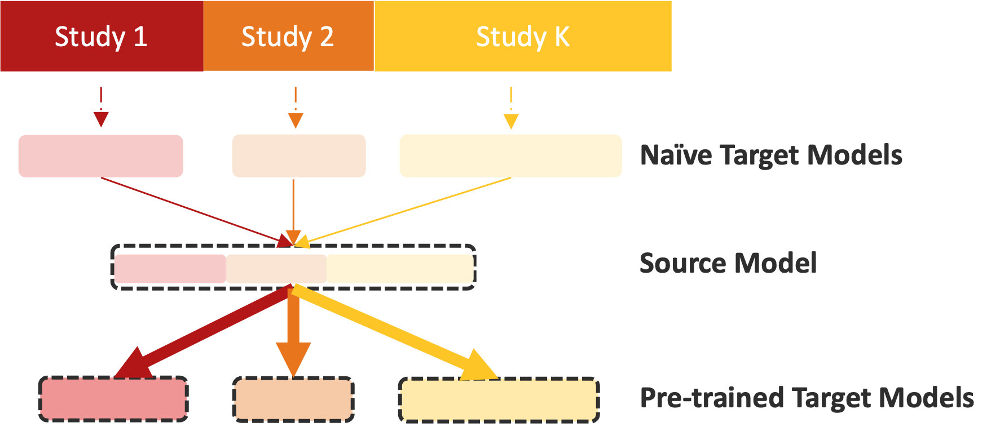
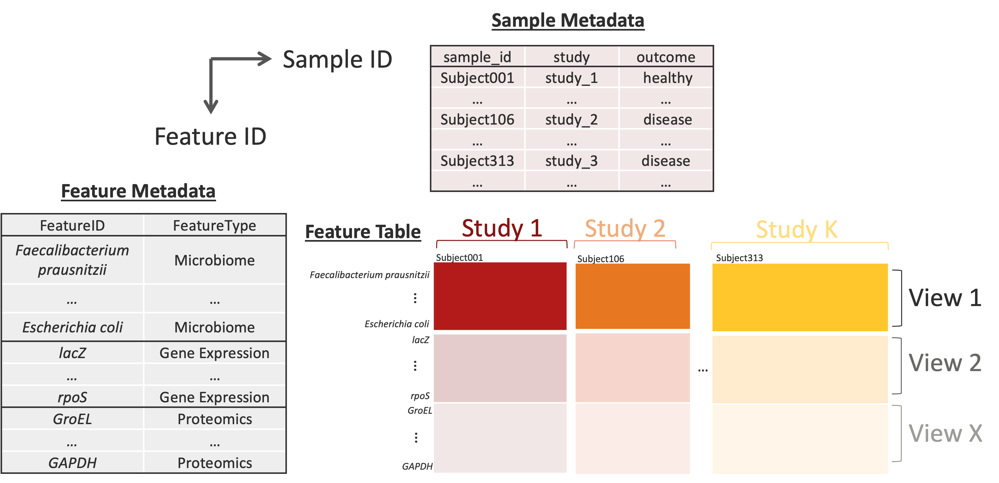
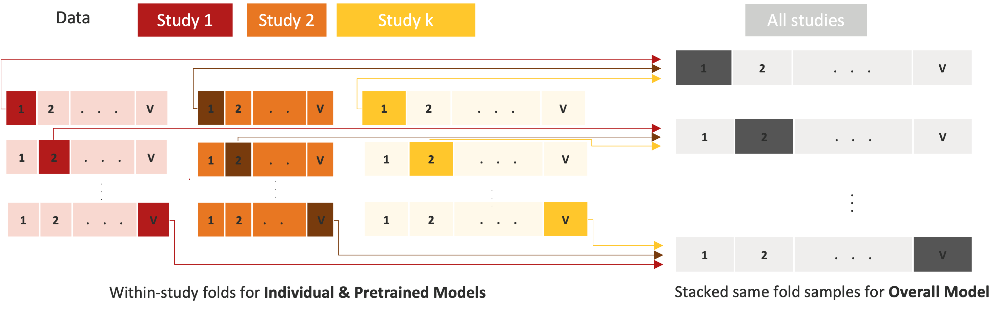

# GPTLasso

This repository houses the R package for multistudy multimodal transfer learning using **Global Pretraining and LASSO (`GPTLasso`)**. It extends the `ptLasso` framework to support global multimodal learning across multiple studies through cooperative-learning-based pretraining and transfer learning.



## Background

Modern biomedical prediction problems often involve multiple data modalities collected across several related cohorts, while each individual study may still be too small for stable model fitting. This project addresses that setting by combining multimodal modeling with transfer learning so that information can be shared across both studies and modalities while still allowing study-specific refinement.

The framework uses a pretrained multimodal model to learn shared structure, then fine-tunes study-level fits for improved local prediction. In simulations and motivating multi-omics applications, the goal is to improve predictive accuracy, estimation quality, and cross-study generalization relative to single-study or single-modal approaches.

**Keywords:** Transfer learning, Cooperative learning, Multistudy analysis, Multimodal Integration, LASSO, Pretraining

## Installation

You can install the development version directly from GitHub:

``` r
install.packages("devtools")
devtools::install_github("himelmallick/GPTLasso")
library(GPTLasso)
```

## Get Started

### Bioconductor-style Input

GPTLasso requires a `x` as a named list containing `feature_table`, `sample_metadata`, and `feature_metadata`.



**Note on `study` Labels:**

`gptLasso` detects the study levels directly from `x$sample_metadata$study`. The unique values in that column, in their observed order, define the groups used to split the training data, construct study-specific models, and organize prediction summaries.

In this repository, `study` is the motivating example for handling different groups of data. In practice, users are welcome to define their own project-tailored grouping that serves the scientific or operational goal of the analysis.

### Tool

``` r
fit <- gptLasso(
    x,                                                      # Input
    Target = NULL                                           # A character vector of study names specifying target study(s) or NULL (all studies)
    alpha.ptlasso = 0.5,                                    # Transfer-learning level in `[0, 1]`
    family = c("gaussian", "binomial"),                     # Response family
    type.measure = c("default", "mse", "auc", "deviance"),  # Cross-validation metric used inside the multiview fits
    rho = seq(0, 1, length = 11),                           # Multiview cooperative learning confusion stage parameter, e.g., rho=0 -> early fusion
    overall.lambda = c("lambda.1se", "lambda.min"),         # Lambda rule used for the stage-one overall model
    ind.lambda = c("lambda.1se", "lambda.min"),             # Lambda rule used for the individual models
    pre.lambda = c("lambda.1se", "lambda.min"),             # Lambda rule used for the pretrained models
    nfolds = 10,                                            # Number of folds used when `foldid` is not supplied
    alpha_glmnet = 1                                        # Elastic-net mixing parameter, default is 1 indicating Lasso regression
)
```

## Tutorial

This Gaussian example tutorial walks through simulated data generation, model fitting, transfer-level tuning, and prediction on held-out data.

### 1. Simulate Gaussian multistudy multiview data

``` r
set.seed(1234)

gaussian_sim <- sim.gaussian.data()
x_train <- gaussian_sim$x_train
x_test <- gaussian_sim$x_test
y_test <- split(x_test$sample_metadata$Y, x_test$sample_metadata$study)
```

Inspect the container layout before fitting:

``` r
str(x_train, max.level = 1)
colnames(x_train$sample_metadata)
table(x_train$sample_metadata$study)
```

Example output:

``` text
==============================
Gaussian x_train 
==============================
List of 3
 $ feature_table   : num [1:658, 1:840] 0.0261 0.0215 0.7405 0.0733 0.2195 ...
  ..- attr(*, "dimnames")=List of 2
 $ sample_metadata :'data.frame':       840 obs. of  5 variables:
 $ feature_metadata:'data.frame':       658 obs. of  2 variables:

Sample metadata columns:
[1] "subjectID" "Y" "study"   "sample_id"

Study counts:

Study_1 Study_2 Study_3 
    350     280     210 
```

### 2. Fit a multistudy multiview transfer-learning model with `cv.gptLasso()` targetting at all studies

``` r
cv_fit <- cv.gptLasso(
  x = x_train,                                  # Training input
  target = NULL,                                # Default NULL that fitting study-specific models for all studies
  family = "gaussian",                          # Response family
  type.measure = "mse",                         # Cross-validation metric used inside the multiview fits
  rho = seq(0, 1, length = 11),                 # Multiview cooperative learning fusion stage parameter
  alpha.ptlasso.list = seq(0, 1, length = 11),  # Numeric vector of transfer-learning values to compare
  overall.lambda = "lambda.min",                # Lambda rule for the overall model when summarizing CV performance
  ind.lambda = "lambda.1se",                    # Lambda rule for individual models when summarizing CV performance
  pre.lambda = "lambda.1se",                    # Lambda rule for pretrained models when summarizing CV performance
  nfolds = 10,                                  # Cross-validation fold
  verbose = TRUE                                # Track model fitting
)
```

**Note on fold construction for fitting models:**

When `foldid` is not specified, the algorithm automatically constructs V folds (i.e., `nfolds = V`) by partitioning samples within each study. The same within-study fold assignments are used consistently across both the individual models and the pretrained models. To fit the cooperative learning–based overall model, samples from the same fold across studies are stacked by view to form the V-fold training datasets.



Inspect the selected alpha and the performance grid:

``` r
cv_fit$alpha.ptlasso.hat          # selected fixed transfer-learning value
cv_fit$varying.alpha.ptlasso.hat  # study-specific transfer-learning values chosen from the same grid
cv_fit$fitpre.rho                 # study-specific fusion stage value of pretrained model
cv_fit$errpre                     # performance of pretrained model for each candidate alpha
```

Example output:

``` text
Gaussian cv.gptLasso() alpha grid summary:
$alpha.ptlasso.hat
[1] 0.6

$varying.alpha.ptlasso.hat
Study_1 Study_2 Study_3 
    1.0     0.7     0.6  

$fitpre.rho     
Study_1 Study_2 Study_3 
      0       0       0 

$errpre
      alpha.ptlasso   pooled     mean   Study_1  Study_2  Study_3
 [1,]           0.0 15.34823 15.68952 13.073108 16.82688 17.16856
 [2,]           0.1 14.13248 14.28925 12.617130 15.75229 14.49833
 [3,]           0.2 13.25893 13.24134 12.104252 15.72660 11.89316
 [4,]           0.3 12.96732 13.02804 12.065310 14.22485 12.79395
 [5,]           0.4 11.91081 12.04923 10.542700 13.40124 12.20375
 [6,]           0.5 11.79913 11.93871 10.604418 12.93230 12.27941
 [7,]           0.6 11.24965 11.34991 10.170764 12.50504 11.37394
 [8,]           0.7 11.54439 11.85441  9.952413 11.93813 13.67268
 [9,]           0.8 11.42027 11.62629  9.995206 12.41626 12.46740
[10,]           0.9 12.09472 12.40493 10.125550 13.24118 13.84805
[11,]           1.0 12.22409 12.74619  9.318009 13.33728 15.58329
```

### 3. Predict on held-out data

``` r
pred <- predict(
  cv_fit,
  xtest = x_test,
  ytest = y_test,
  target = NULL,
  alpha.ptlasso = NULL,           # Optional user-specified transfer-learning choice. May be one value or one per study
  alpha.ptlasso.type = "varying", # Either `"fixed"` or `"varying"` when `alpha.ptlasso` is not supplied
  overall.lambda = "lambda.min",  # Lambda rule for overall-model prediction
  ind.lambda = "lambda.1se",      # Lambda rule for individual-model prediction
  pre.lambda = "lambda.1se",      # Lambda rule for pretrained-model prediction
  type = "response"
)
```

Inspect the prediction object and compare held-out performance across all models from `metrics`:

``` r
names(pred)
pred$metrics$MSE
pred$metrics$r2
```

Example output:

``` text
 [1] "call"                "alpha.ptlasso"       "yhatoverall"        
 [4] "yhatind"             "yhatpre"             "supoverall"         
 [7] "supind"              "suppre.common"       "suppre.individual"  
[10] "type.measure"        "metrics"             "erroverall"         
[13] "errind"              "errpre"              "fit"                
[16] ".metric_predictions"

$MSE
           pooled      mean   Study_1  Study_2   Study_3
overall 16.854384 17.016006 16.005860 17.09683 17.945325
ind     10.472972 10.640624  9.465725 10.97859 11.477557
pre      9.942666  9.919378  9.465725 11.10614  9.186269

$r2        
           pooled      mean   Study_1   Study_2   Study_3
overall 0.5280047 0.5032618 0.5355325 0.5587344 0.4155184
ind     0.7067117 0.6893791 0.7253180 0.7166449 0.6261745
pre     0.7215626 0.7131576 0.7253180 0.7133530 0.7008020
```

**Note on `pooled` Vs `mean`:**

`pooled`: metric on all stacked samples, so larger studies contribute more

(sample-weighted for MSE/deviance/class error;for AUC it is global pooled ranking, not a simple arithmetic average).

`mean`: average of study-level metrics, each study weight = 1/k.

### 4. Tutorial: **`Target` is all you need**

Please see additional [tutorial](docs/tutorial.html) for **target-aware GPTLasso workflow** with explicit source/target definitions and full end-to-end pipelines.

## Citation

If you use this repository, please cite it as:

``` text
Gao C, Mallick H (2026). Multistudy Multimodal Pretraining and Transfer Learning.
Research abstract and open-source software for multistudy, multimodal transfer learning.
```

## Issues

For bugs, questions, or feature requests: contact information to be added.
